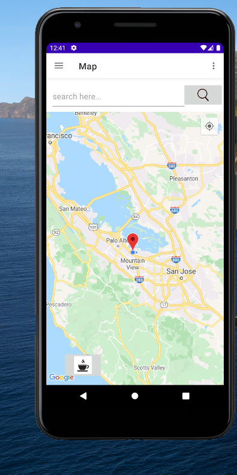
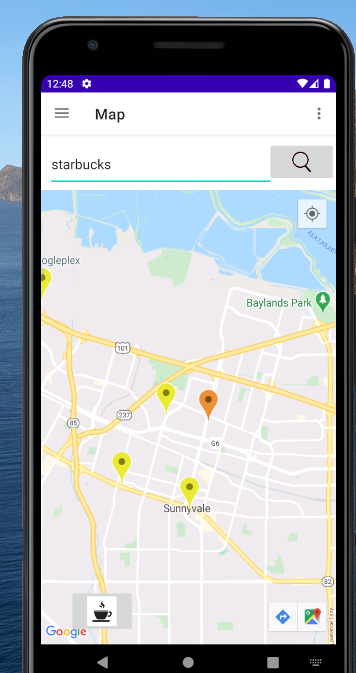
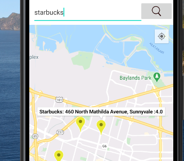
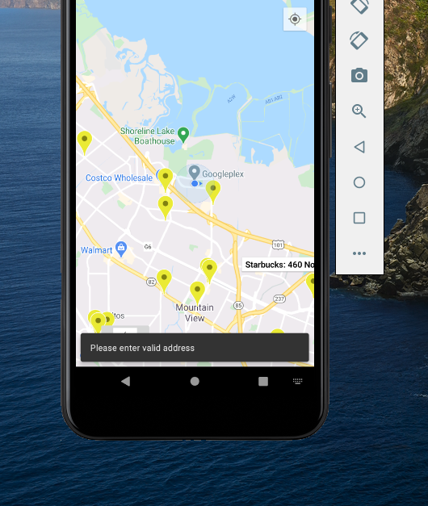
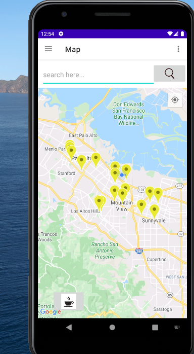

<h1>
Near by Cafe</h1> 

 <h4>About</h4> 
 <ul>
 <li>This Android application uses the Google maps/ location services to look for nearby cafes in the area by getting the user's current location. </li> 
 </ul>  
 

<h4>App Screens</h4> 

<h3>Main</h3> 

<ul>
 <li><h4> Map View </h4>.</li> 

 </ul>  

<h3>Cafe by Ratings : Fetched from Google API</h3> 

<ul>
 <li><h4> Recycler View </h4>.</li> 

 </ul>  

<h3>Search : Fetched from Google API</h3> 

<ul>
 <li><h4> searched cafe in red marker, nearby cafes in yellow marker. </h4>.</li> 

 </ul>  

<h3>Handle Errors</h3> 

<ul>
 <li><h4> Snack Bar. </h4>.</li> 

 </ul>  

 <h3>See all shops near by</h3> 

<ul>
 <li><h4> Google API calls. Radius Parameter. </h4>.</li> 

 </ul>  

<h3>Add</h3> 

<h3>Nav Bar</h3> 

